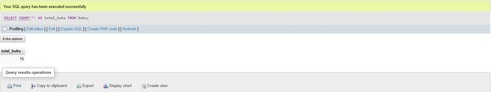

# PERPUSTAKAAN

Project studi kasus nyata sistem perpustakaan. Mata kuliah Pemrograman Web 2, menggunakan Bahasa pemrograman PHP, library Laravel, dan Database MySQL

## Tugas 1 (Pertemuan 6) : Eksplorasi Database dengan Query (40%)

### Dokumentasi Hasil Query (Screenshot)

#### 1 Statistik Buku (5 Query)

1.1 Total jumlah buku aktif  

